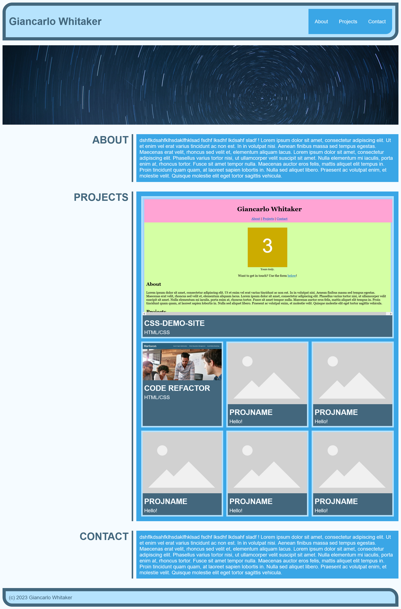

# Portfolio

This code is for a website showing a portfolio of my work.  This portfolio began as a class project, with the following requirements listed below:

>Welcome to this week's Challenge! This is an even-numbered week, so you won't be given any starter code. Instead, you'll create a web application from scratch! This week, you'll build a portfolio page, which you can add to as the course progresses. 

>A portfolio of work can showcase your skills and talents to employers looking to fill a part-time or full-time position. An effective portfolio highlights your strongest work as well as the thought processes behind it. Students who have portfolios with deployed web applications (meaning they are live on the web) are typically very successful in their career search after the boot camp. This last point can’t be stressed enough: having several deployed projects is a minimum requirement to receive an initial interview at many companies. 

## Acceptance Criteria

The qualifications for the assignment to be met were the following:

```
GIVEN I need to sample a potential employee's previous work
WHEN I load their portfolio
THEN I am presented with the developer's name, a recent photo or avatar, and links to sections about them, their work, and how to contact them
WHEN I click one of the links in the navigation
THEN the UI scrolls to the corresponding section
WHEN I click on the link to the section about their work
THEN the UI scrolls to a section with titled images of the developer's applications
WHEN I am presented with the developer's first application
THEN that application's image should be larger in size than the others
WHEN I click on the images of the applications
THEN I am taken to that deployed application
WHEN I resize the page or view the site on various screens and devices
THEN I am presented with a responsive layout that adapts to my viewport
```


## Mock-Up

The deployed website should look like this:

